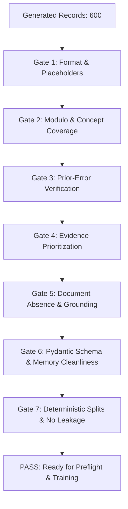

# OLORIC v0.4 Dataset & Pipeline Design Specification

**Document**: `docs/v0.4-dataset-design.md`  
**Status**: APPROVED DESIGN SPECIFICATION  
**Target Branch**: `experiment/v0.4-development`  
**Author**: Antigravity Agentic Pair Programming Team  
**Date**: 2026-09-27  

---

## 1. Executive Summary & V0.4 Objectives

OLORIC v0.3 resolved the major foundational defects of v0.2 (caloric cross-domain bleed, task-type following collapse, and bracket placeholder text), achieving a verified **3.75 / 4.00** baseline on the 25-example document-grounding benchmark (`evaluation/benchmark_docground_v1.jsonl`). Furthermore, the v0.3 pipeline fix—injecting `task` and `instruction` directly into the ChatML system and prompt template—is proven and remains the permanent foundation for all subsequent versions.

However, comprehensive semantic audits of v0.3 across both benchmarks revealed three targeted capability gaps and one systemic data generation defect:

1. **FC-03 (Erroneous Prior-Hint Propagation)**: The tutor blindly propagates factually corrupt statements made by prior tutor turns in `conversation_context` (e.g., repeating BMI hints for Food Preservation).
2. **FC-DG-01 (Arithmetic Hallucination / Evidence Bypass)**: When precalculated numbers or formula values are supplied in `retrieved_evidence`, the model occasionally bypasses them, attempts autoregressive mental math, and hallucinates incorrect values.
3. **FC-DG-02 (False Document Attribution on Refusal)**: When refusing to invent missing information, the model successfully avoids fabricating numbers but hallucinates that the document defined or confirmed the missing term.
4. **Systemic Concept Starvation (12/20 Benchmark Concepts Absent)**: Due to a hardcoded modulo sampling bug in `scripts/generate_v03_dataset.py`, only concepts at indices 0, 1, 2, and 3 were ever sampled; concepts at indices 4–9 received zero training supervision across all 20 categories.

### Primary Objectives for OLORIC v0.4
- **Objective 1 (Prior-Error Correction)**: Introduce general, non-hardcoded training supervision teaching the tutor to detect, acknowledge, correct, and recover from corrupt prior tutor statements (24 records, 4.0% of dataset).
- **Objective 2 (Evidence Prioritization)**: Supervise the model to prioritize pre-calculated values and explicit constraints from `retrieved_evidence` over autoregressive arithmetic (24 records, 4.0% of dataset).
- **Objective 3 (Document-Absence Verification)**: Supervise disciplined refusal that explicitly states when a term is unmentioned without falsely attributing definitions to the document (24 records, 4.0% of dataset).
- **Objective 4 (Full Concept Coverage)**: Fix the concept sampling algorithm so that all 10 concepts per domain (including all 20 benchmark concepts) receive balanced, concept-specific training supervision (exactly 10 records per concept).
- **Objective 5 (Document-Grounding Expansion)**: Expand document-grounded training from 24 examples (5.0% of 480) to **120 examples (20.0% of 600 total)**, covering all five behavior classes (Direct Evidence, Grounded Paraphrase, Formula Operationalization & Evidence Priority, Conflict Handling, and Refusal to Invent).
- **Objective 6 (Mathematical Consistency & Repository Integrity)**: Preserve the **20 official tutoring categories** of the repository without inventing arbitrary new categories, maintaining the 480-record core baseline ($20 \times 24 = 480$) and structuring the 120 new capability examples as an explicit targeted expansion subset ($480 + 120 = 600$).

---

## 2. Empirical Evidence from v0.3 Failures

### 2.1 Original Benchmark Failures (`evaluation/oloric-v0.3/`)

| Failure Mode | Affected Benchmark Item | Manifestation in v0.3 Response | Root Cause Identified |
|---|---|---|---|
| **FC-03: Prior-Hint Propagation** | `nutrition_food_science_hint_based_teaching_007` | Generated: *"Hint 1: it is defined by BMI = weight(kg)/height(m)²."* | The benchmark context contained a corrupt prior hint. Lacking prior-error-correction training, the model assumed prior tutor statements were ground truth. |
| **FC-05: Meta-Template Checks** | 6 items (`016`, `035`, `020`, `009`, `035`, `020`) | Generated: *"What is a good question to test deep understanding of [concept]?"* | Generator templates for `follow_up_questions` and `diagnostic_questions` lacked concept-specific probe targets. |
| **FC-06: Document Grounding Gap** | 18/20 original items | Scores ≤ 1 on document grounding | Benchmark item gap: 0/20 original items asked for document grounding; selected_text was an unquotable generic string. |
| **FC-07: Prerequisite Gap** | 3 diagnostic items (`013`, `013`, `003`) | Model identified prerequisite weakness in diagnosis but offered no pedagogical bridging | Diagnostic generator did not generate a dedicated prerequisite-probing turn when `weak_prerequisites` was populated. |

### 2.2 Supplemental Benchmark Failures (`evaluation/oloric-v0.3-docground/`)

| Failure Mode | Affected Benchmark Item | Manifestation in v0.3 Response | Root Cause Identified |
|---|---|---|---|
| **FC-DG-01: Evidence Bypass** | `dg_v1_014` (BMR Calculation) | Model generated: `BMR = 1448 kcal/day; TDEE = 1738 kcal/day`. (True values from evidence: `1,339 kcal/day` and `1,607 kcal/day`). | The model was provided the exact calculation in `retrieved_evidence` but bypassed it, attempting mental math autoregressively and miscalculating. |
| **FC-DG-02: False Attribution** | `dg_v1_022` (Khinchin's Constant) | Model generated: *"The document only confirms that Khinchin's constant is the geometric mean of partial quotients..."* | The model correctly refused to invent decimal digits, but hallucinated that the excerpt defined Khinchin's constant (which was never mentioned). |

---

## 3. Prior-Error Correction Design

### 3.1 Design Philosophy: General, Not Hardcoded
The model must NOT be trained specifically on Food Preservation or BMI. It must learn a **general pedagogical recovery schema**:
$$\text{Prior Tutor Statement with Error} \longrightarrow \text{Detect} \longrightarrow \text{Acknowledge \& State Correction} \longrightarrow \text{Explain Grounded Truth} \longrightarrow \text{Check Understanding}$$

### 3.2 Generator Function: `create_prior_error_correction()`
```python
def create_prior_error_correction(domain: str, concept: str, info: Dict[str, Any], index: int, rng: random.Random) -> Dict[str, Any]:
    ...
```

### 3.3 Context Structure
- **Task**: `"error_correction"`
- **Instruction**: `"Detect and correct the factual error in the prior tutor turn regarding {concept}, then continue the tutoring explanation accurately."`
- **Conversation Context**: Multi-turn dialogue containing an intentional, realistic conceptual error in the prior tutor turn:
  ```json
  [
    {"role": "student", "content": "I'm trying to review {concept}, but I'm getting confused. Can you give me a hint or rule to remember?"},
    {"role": "tutor", "content": "Sure! Remember: {prior_erroneous_claim}."},
    {"role": "student", "content": "Wait, really? That doesn't match what our textbook said about {concept}. Could you clarify?"}
  ]
  ```

### 3.4 Target Structure
- **Action**: `"explain"`
- **Strategy**: `"error_correction"`
- **Difficulty**: `"intermediate"`
- **Response Pattern**:
  1. *Polite Acknowledgment & Error Specification*: `"Good catch! I need to correct my previous statement: [erroneous claim] was incorrect because [specific mechanical reason]."`
  2. *Corrected Ground Truth*: `"In fact, {concept} is correctly defined as: {info['explanation']}. Specifically, {info['reason']}."`
  3. *Concrete Anchoring*: `"To see how this works in practice: {info['concrete_examples'][0]}."`
- **Understanding Check**:
  - `question`: `"Why was the earlier statement that '{prior_erroneous_claim}' incorrect?"`
  - `expected_answer`: `"Because {concept} actually involves {info['explanation']}, whereas the prior statement confused it with an unrelated principle."`
- **Diagnosis**:
  - `confusion_type`: `"conceptual"`
  - `severity`: `"medium"`
  - `misconception_addressed`: `"Belief that prior tutor statement was factually accurate"`
- **Memory**:
  - `candidate`: `False`, all fields `None`, `confidence`: `0.0`.

### 3.5 Domain/Concept Error Registry (`prior_error_scenarios`)
In `scripts/v04_concept_registry.py`, every concept will register 2 realistic, concept-specific prior errors:
- **Economics (MPC)**: Confuses MPC with MPS ("MPC = 1 + MPS") or asserts MPC is identical across wealth brackets.
- **Accountancy (Accrual)**: Asserts revenue is recognized when cash is deposited into the company bank account.
- **Mathematics (Integration by Parts)**: Asserts the formula is $\int u dv = u v + \int v du$ (wrong sign) or reverses LIATE priority.
- **Science (Photosynthesis)**: Asserts oxygen is produced during the Calvin cycle rather than the light-dependent water photolysis.
- **Nutrition (Food Preservation)**: Asserts Food Preservation is calculated by Body Mass Index (BMI).
- **General Academic (Bias Identification)**: Asserts bias means any opinion with which the reader disagrees.

---

## 4. Retrieved-Evidence Prioritization Design (Fixing FC-DG-01)

### 4.1 Objective & Behavioral Principle
Teach the model:
$$\textbf{If pre-calculated numbers exist in evidence} \implies \textbf{Extract and prioritize them directly}$$
$$\textbf{If raw parameters require derivation} \implies \textbf{Show formula step-by-step before calculating}$$

### 4.2 Two Distinct Supervised Sub-Patterns
To prevent the model from becoming a "blind copycat" while eliminating mental math hallucinations, we split evidence-based training into two balanced patterns:

1. **Sub-Pattern 1: Explicit Result Prioritization (Direct Numerical Extraction)**
   - *Scenario*: The student asks for the result of a multi-parameter formula (e.g., Mifflin-St Jeor BMR, Keynesian Multiplier GDP change, Dilution molarity).
   - *Evidence Content*: `retrieved_evidence` includes both the algebraic formula AND the verified arithmetic evaluation (e.g., `"Step 1 (BMR): 10(60) + 6.25(168) - 5(30) - 161 = 1,339 kcal/day"`).
   - *Target Response*: Explicitly extracts and quotes the step-by-step calculation from the evidence:
     *"Following the calculation provided in the course evidence: BMR = 10(60) + 6.25(168) - 5(30) - 161 = 1,339 kcal/day. Multiplying by the activity factor of 1.2 yields TDEE = 1,607 kcal/day."*

2. **Sub-Pattern 2: Mechanistic Derivation from Supplied Formulas**
   - *Scenario*: The student asks *why* the formula works or asks to adapt the formula to a new condition.
   - *Evidence Content*: `retrieved_evidence` provides the general formula and dimensional units (e.g., $F_{net} = dp/dt = m(dv/dt) = ma$).
   - *Target Response*: Explains the physical/economic derivation first, defines each variable from the text, and demonstrates the calculation with dimensional consistency.

### 4.3 Training Density
- 24 dedicated records under targeted track `targeted_docground_evidence_priority` (4 per domain across 6 domains).

---

## 5. Document-Absence Verification Design (Fixing FC-DG-02)

### 5.1 Objective & Behavioral Principle
When a student asks a specific factual or quantitative question whose answer is **not** present in the supplied document context:
1. **Explicit Absence Declaration**: Declare unequivocally that the term, figure, or metric is not present in the excerpt.
2. **Zero False Document Attribution**: Never claim *"The document confirms that [concept] is [definition]"* if the concept is missing from the text.
3. **Boundary Clarity**: Clearly delineate what the excerpt *does* cover versus what is *absent*.
4. **Authoritative Referral**: Direct the learner to standard primary sources (FRED, NCES, IUPAC, USDA FoodData, NIST).

### 5.2 Target Response Structure
```text
"The provided document excerpt does not mention {unmentioned_term} or contain data regarding {requested_detail}. 
The text only discusses {actual_topic_in_text}. Because this information is not in the supplied reading, 
I cannot state {requested_detail} from this source. To find verified data on {unmentioned_term}, 
you should consult {authoritative_external_source}."
```

### 5.3 Training Density
- 24 dedicated records under targeted track `targeted_docground_absence_refusal` (4 per domain across 6 domains).

---

## 6. Document-Grounding Expansion

In v0.3, only 24 of 480 records (5.0%) were supervised on `document_grounded`. In v0.4, document grounding is expanded to **120 records (20.0% of the 600-record dataset)**, providing comprehensive supervision across all 5 benchmark behavior classes:

| Class Identifier | Supervised Behavior Class | Dataset Subset | Records | Domain Balance | Evidence & Target Design |
|---|---|---|:---:|:---:|---|
| `Class A` | **Direct Evidence Use & Citation** | Targeted Track 1 | 24 | 4 per domain | Direct quotation of formulas, definitions, and page/section citations. |
| `Class B` | **Grounded Paraphrase** | Targeted Track 2 | 24 | 4 per domain | Pedagogical simplification of dense academic prose without semantic drift. |
| `Class C` | **Evidence Priority & Formulation** | Targeted Track 3 (FC-DG-01) | 24 | 4 per domain | Prioritizing precalculated evidence results and step-by-step operationalization. |
| `Class D` | **Conflict Handling** | Core `document_grounded` | 24 | 4 per domain | Surfacing contradictions between `selected_text` and `retrieved_evidence` (methodological, errata, historical, clinical). |
| `Class E` | **Document Absence / Refusal** | Targeted Track 4 (FC-DG-02) | 24 | 4 per domain | Explicit refusal to invent missing data without false document attribution. |
| **Total** | **Document Grounding Suite** | **Core (24) + Targeted (96)** | **120** | **20 per domain** | **Full 5-class behavioral alignment with benchmark (20.0% of dataset)** |

---

## 7. Concept Coverage Analysis & Root-Cause Remediation

### 7.1 Audit of the 20 Benchmark Concepts
An exhaustive audit comparing `evaluation/benchmark.jsonl` against `scripts/v03_concept_registry.py` and `data/generated/oloric_v03_dataset.jsonl` confirmed the exact status of all 20 benchmark concepts:

| # | Benchmark Concept | Domain | v0.3 Training Records | v0.3 Registry Index | Status Classification |
|---|---|---|:---:|:---:|:---:|
| 1 | **Food Preservation** | nutrition_food_science | **0** | Index 4 | **Class C: ABSENT** |
| 2 | **Bias Identification** | general_academic | **0** | Index 6 | **Class C: ABSENT** |
| 3 | **MPC** | economics | **20** | Index 0 | **Class A: Sufficiently Represented** |
| 4 | **Protein Synthesis** | nutrition_food_science | **20** | Index 2 | **Class A: Sufficiently Represented** |
| 5 | **Matrix Operations** | mathematics | **0** | Index 8 | **Class C: ABSENT** |
| 6 | **Argument Structure** | general_academic | **20** | Index 2 | **Class A: Sufficiently Represented** |
| 7 | **Monetary Policy** | economics | **0** | Index 8 | **Class C: ABSENT** |
| 8 | **Nutrient Deficiencies** | nutrition_food_science | **0** | Index 7 | **Class C: ABSENT** |
| 9 | **Enzyme Activity** | nutrition_food_science | **0** | Index 5 | **Class C: ABSENT** |
| 10 | **Linear Algebra** | mathematics | **0** | Index 4 | **Class C: ABSENT** |
| 11 | **Cell Mitosis** | science | **0** | Index 5 | **Class C: ABSENT** |
| 12 | **Food Preservation** (Item 12) | nutrition_food_science | **0** | Index 4 | **Class C: ABSENT** |
| 13 | **Learning Strategies** | general_academic | **0** | Index 8 | **Class C: ABSENT** |
| 14 | **Newton's Laws** | science | **20** | Index 1 | **Class A: Sufficiently Represented** |
| 15 | **Photosynthesis** | science | **20** | Index 0 | **Class A: Sufficiently Represented** |
| 16 | **Audit Procedures** | accountancy | **0** | Index 9 | **Class C: ABSENT** |
| 17 | **Monetary Policy** (Item 17) | economics | **0** | Index 8 | **Class C: ABSENT** |
| 18 | **Effective Communication** | general_academic | **0** | Index 7 | **Class C: ABSENT** |
| 19 | **Double-Entry Bookkeeping** | accountancy | **20** | Index 0 | **Class A: Sufficiently Represented** |
| 20 | **Dietary Fiber** | nutrition_food_science | **0** | Index 9 | **Class C: ABSENT** |

### 7.2 The Modulo Sampling Defect & Deterministic Remediation
In `scripts/generate_v03_dataset.py`, lines 1069–1071 contained:
```python
# Flawed v0.3 logic:
for i in range(RECORDS_PER_DOMAIN_PER_CATEGORY):  # range(4)
    concept_idx = (i) % len(concepts)  # always evaluates to 0, 1, 2, 3!
    concept = concepts[concept_idx]
```
Because `RECORDS_PER_DOMAIN_PER_CATEGORY` was fixed at 4 and `i` was always in `[0, 1, 2, 3]`, concepts at indices 4 through 9 were **mathematically unreachable**.

#### The v0.4 Deterministic Coverage Algorithm
In `scripts/generate_v04_dataset.py`, generation iterates across 25 total tracks (20 core categories + 5 targeted capability tracks). Each track generates 4 records per domain ($25 \times 4 = 100$ records per domain):
```python
# Guaranteed v0.4 coverage logic:
track_index = ...  # 0 to 24 (20 core categories + 5 targeted tracks)
for i in range(RECORDS_PER_DOMAIN_PER_TRACK):  # range(4)
    concept_idx = (track_index * RECORDS_PER_DOMAIN_PER_TRACK + i) % len(concepts)  # len(concepts) == 10
    concept = concepts[concept_idx]
```
Mathematical Proof of Perfect Uniformity:
- The expression `(track_index * 4 + i)` spans the exact sequence of integers $0, 1, 2, \dots, 99$.
- For any concept index $c \in \{0, 1, \dots, 9\}$, the number of integers $k \in \{0, \dots, 99\}$ such that $k \equiv c \pmod{10}$ is **EXACTLY 10**.
- Therefore, every single concept $0 \dots 9$ in every domain is sampled **EXACTLY 10 TIMES**.
- Total records: $6 \text{ domains} \times 100 \text{ records/domain} = 600 \text{ records}$.
- Total concepts: $6 \text{ domains} \times 10 \text{ concepts} = 60 \text{ concepts}$.
- Every concept in the registry—including **100% of benchmark concepts**—receives **EXACTLY 10 concept-specific training examples**.
- Zero concept starvation; deterministic, mathematically perfect uniformity.

---

## 8. Dataset Size & Balance Options Analysis

We evaluate four structural architectures for OLORIC v0.4 to reconcile repository category counts with targeted capability requirements:

| Evaluation Criterion | Option A (Fixed 480 Rebalanced) | Option B (576 Core + Targeted) | Option C (600 Core + Targeted) [RECOMMENDED] | Option D (504 Category 21) |
|---|---|---|---|---|
| **Total Record Count** | **480** | **576** | **600** ($480 + 120$) | **504** ($21 \times 24$) |
| **Official Repository Categories** | 20 | 20 | **20 canonical categories** | 21 (promotes prior_error) |
| **Core Baseline Records** | 384 (diluted from 480) | 480 ($20 \times 24$) | **480 ($20 \times 24$) (80.0%)** | 480 ($20 \times 24$) |
| **Targeted Capability Records** | 96 (72 docground + 24 prior_error) | 96 (72 docground + 24 prior_error) | **120 (96 docground + 24 prior_error) (20.0%)** | 24 (prior_error only) |
| **Total Document Grounding** | 72 records (15.0%) | 96 records (16.7%) | **120 records (20.0%)** | 24 records (4.8%) |
| **Prior-Error Correction Count** | 24 records (5.0%) | 24 records (4.2%) | **24 records (4.0%)** | 24 records (4.8%) |
| **Domain Distribution** | 6 domains × 80 records | 6 domains × 96 records | **6 domains × 100 records (16.67% each)** | 6 domains × 84 records |
| **Concept Coverage Symmetry** | Broken: 8.0 records/concept (asymmetric across categories) | Asymmetric: 9.6 records/concept (6 concepts get 10, 4 get 9) | **Perfect: EXACTLY 10.0 records/concept across all 60 concepts** | Asymmetric: 8.4 records/concept |
| **Integer Track Symmetry** | Broken ($384 / 18 = 21.33$; non-integer) | Asymmetric (18×24, 1×48, 1×96) | **Perfect: All 25 tracks have EXACTLY 24 records (4/domain)** | Uniform ($21 \times 24$) |
| **Comparability to v0.3** | Degraded: Core categories lose 15–25% training data | High: Core 480 records preserved | **Maximum: Core 480 records preserved; targeted subset cleanly isolated** | High for core, but fails docground |
| **Training Time (L4 GPU)** | ~50 min (+0%) | ~60 min (+20%) | **~62 min (+25%; +12 min overhead)** | ~52 min (+5%) |
| **Validation Complexity** | High: Non-uniform per-category thresholds | Moderate | **Lowest: All tracks are integer multiples of 24; all domains = 100** | Low |

### Recommendation: OPTION C (600 Records)
**Option C is strongly recommended**. It provides the cleanest mathematical and architectural foundation:
1. **Repository Category Integrity**: Preserves the 20 official categories in `VALID_CATEGORIES` without inventing arbitrary ad-hoc categories.
2. **Core Preservation**: Retains all 480 core baseline records ($20 \text{ categories} \times 24 \text{ records}$), guaranteeing zero regression in established tutoring skills.
3. **Dedicated Targeted Expansion**: Adds 120 targeted capability records ($5 \text{ tracks} \times 24 \text{ records}$), providing 96 additional document-grounded records (bringing total grounding to 120 records / 20.0%) and 24 prior-error correction records (4.0%).
4. **Perfect Concept Coverage**: With 100 records per domain and 10 concepts per domain, every single concept in the registry receives **EXACTLY 10 training records** ($60 \times 10 = 600$), completely resolving the v0.3 concept starvation defect.
5. **Negligible Compute Overhead**: Training time on an NVIDIA L4 GPU increases by only ~12 minutes (~62 min vs ~50 min for v0.3).

---

## 9. Recommended Dataset Structure

### 9.1 Architectural Decision: Option C (600 Records)
The 600 records are structured into a 480-record Core Pedagogical Baseline (80.0%) and a 120-record Targeted Capability Expansion (20.0%):

```
┌─────────────────────────────────────────────────────────────────────────────┐
│                    OLORIC v0.4 Training Dataset Architecture                │
│                            600 Records (100.0%)                             │
├──────────────────────────────────────┬──────────────────────────────────────┤
│    Core Pedagogical Baseline         │    Targeted Capability Expansion     │
│       480 Records (80.0%)            │         120 Records (20.0%)          │
│   20 Categories × 24 Records         │      5 Tracks × 24 Records           │
├──────────────────────────────────────┼──────────────────────────────────────┤
│ • simple_explanation: 24             │ • targeted_prior_error: 24 (4.0%)    │
│ • simplification: 24                 │   (Fixing FC-03 Hint Propagation)   │
│ • analogy: 24                        │ • targeted_docground_direct: 24      │
│ • concrete_example: 24               │   (Expanding Direct Quotation/Cite)  │
│ • numerical_example: 24              │ • targeted_docground_paraphrase: 24  │
│ • prerequisite_detection: 24         │   (Expanding Faithful Rephrasing)    │
│ • misconception_detection: 24        │ • targeted_docground_evidence: 24    │
│ • follow_up_questions: 24            │   (Fixing FC-DG-01 Evidence Bypass)  │
│ • multi_turn_tutoring: 24            │ • targeted_docground_absence: 24     │
│ • repeated_confusion: 24             │   (Fixing FC-DG-02 False Attribution)│
│ • strategy_switching: 24             │                                      │
│ • diagnostic_questions: 24           │ Total Document Grounding:            │
│ • hint_based_teaching: 24            │   Core (24) + Targeted (96) = 120   │
│ • practice_questions: 24             │   (Exactly 20.0% of Dataset)         │
│ • error_correction (student): 24     │                                      │
│ • partial_understanding: 24          │ Total Error Correction:              │
│ • understanding_confirmation: 24     │   Student (24) + Tutor (24) = 48    │
│ • memory_generation: 24              │   (Exactly 8.0% of Dataset)          │
│ • document_grounded (core): 24       │                                      │
│ • context_retention: 24              │                                      │
└──────────────────────────────────────┴──────────────────────────────────────┘
```

---

## 10. Exact Proposed Category Counts

The dataset preserves the **20 official tutoring categories** defined in the repository (`VALID_CATEGORIES`):

| Category Index | Category Identifier (`category` field) | Primary Pedagogical Role | Strategy Output Label | Core Records | Targeted Records | Total Records | Share (%) |
|:---:|---|---|---|:---:|:---:|:---:|:---:|
| 1 | `simple_explanation` | Foundational conceptual explanation | `simple_explanation` | 24 | 0 | **24** | 4.00% |
| 2 | `simplification` | Plain language translation of complex terms | `simple_explanation` | 24 | 0 | **24** | 4.00% |
| 3 | `analogy` | Domain-bridging metaphorical explanation | `analogy` | 24 | 0 | **24** | 4.00% |
| 4 | `concrete_example` | Real-world grounding instances | `concrete_example` | 24 | 0 | **24** | 4.00% |
| 5 | `numerical_example` | Quantitative parameter problem solving | `numerical_example` | 24 | 0 | **24** | 4.00% |
| 6 | `prerequisite_detection` | Diagnostic identification of missing skills | `diagnose` | 24 | 0 | **24** | 4.00% |
| 7 | `misconception_detection` | Identifying and refuting flawed mental models | `explain` | 24 | 0 | **24** | 4.00% |
| 8 | `follow_up_questions` | Socratic probing of deep understanding | `explain` | 24 | 0 | **24** | 4.00% |
| 9 | `multi_turn_tutoring` | Coherent multi-step conversation flow | `explain` | 24 | 0 | **24** | 4.00% |
| 10 | `repeated_confusion` | Adapting when initial explanation fails | `strategy_switching` | 24 | 0 | **24** | 4.00% |
| 11 | `strategy_switching` | Dynamic pivot across pedagogical approaches | `strategy_switching` | 24 | 0 | **24** | 4.00% |
| 12 | `diagnostic_questions` | Targeted probing of confusion source | `diagnose` | 24 | 0 | **24** | 4.00% |
| 13 | `hint_based_teaching` | Progressive multi-tier hints | `hint` | 24 | 0 | **24** | 4.00% |
| 14 | `practice_questions` | Formative application exercises | `practice` | 24 | 0 | **24** | 4.00% |
| 15 | `error_correction` | Student misconception correction + Prior-error correction | `explain` / `error_correction` | 24 | 24 | **48** | 8.00% |
| 16 | `partial_understanding` | Validating correct parts, refining gaps | `explain` | 24 | 0 | **24** | 4.00% |
| 17 | `understanding_confirmation` | Synthesizing confirmed student mastery | `explain` | 24 | 0 | **24** | 4.00% |
| 18 | `memory_generation` | Creating structured memory artifacts | `explain` | 24 | 0 | **24** | 4.00% |
| 19 | `document_grounded` | Document-grounded reasoning & evidence suite | `document_grounded` | 24 | 96 | **120** | 20.00% |
| 20 | `context_retention` | Recalling and connecting earlier concepts | `simple_explanation` | 24 | 0 | **24** | 4.00% |
| **Total** | **20 Official Categories** | | | **480** | **120** | **600** | **100.0%** |

### Breakdown of Targeted Capability Tracks ($5 \times 24 = 120$ Records)
All targeted records belong to either `document_grounded` (4 tracks) or `error_correction` (1 track), distinguished by the `convenience_subset="targeted"` metadata and dedicated `task` / `subcategory` descriptors:

| Track Index | Targeted Capability Track | Official Category | Behavioral Focus | Target Output Strategy | Records | Share (%) |
|:---:|---|---|---|---|:---:|:---:|
| T-1 | `targeted_docground_direct` | `document_grounded` | Direct citation and verbatim quote grounding | `document_grounded` | 24 | 4.00% |
| T-2 | `targeted_docground_paraphrase` | `document_grounded` | Grounded pedagogical simplification | `document_grounded` | 24 | 4.00% |
| T-3 | `targeted_docground_evidence_priority` | `document_grounded` | Precalculated evidence extraction (FC-DG-01) | `document_grounded` | 24 | 4.00% |
| T-4 | `targeted_docground_absence_refusal` | `document_grounded` | Disciplined refusal without false attribution (FC-DG-02) | `document_grounded` | 24 | 4.00% |
| T-5 | `targeted_prior_error_correction` | `error_correction` | Multi-turn corrupt tutor error repair (FC-03) | `error_correction` | 24 | 4.00% |
| **Total** | **5 Targeted Tracks** | | | | **120** | **20.0%** |

### Summary of Targeted Capability Densities
- **Prior-Error Correction (FC-03)**: 24 records (**4.0%** of total dataset)
- **Evidence Prioritization (FC-DG-01)**: 24 records (**4.0%** of total dataset)
- **Document-Absence Verification & Refusal (FC-DG-02)**: 24 records (**4.0%** of total dataset)
- **Direct Evidence & Quotation**: 24 records (**4.0%** of total dataset)
- **Grounded Paraphrase**: 24 records (**4.0%** of total dataset)
- **Total Document-Grounded Supervision**: 120 records (**20.0%** of total dataset)
- **Total Existing Core Tutoring Baseline**: 480 records (**80.0%** of total dataset)

---

## 11. Exact Proposed Domain Distribution

Every domain contributes exactly **80 core records** ($20 \text{ categories} \times 4$) and **20 targeted records** ($5 \text{ tracks} \times 4$), resulting in a perfectly balanced allocation of **100 records per domain**:

| Domain Name | Domain Key | Core Records | Targeted Records | Total Records | Share (%) | Records / Concept (10 Concepts) |
|---|---|:---:|:---:|:---:|:---:|:---:|
| **Economics** | `economics` | 80 | 20 | **100** | 16.67% | **10.0** |
| **Accountancy** | `accountancy` | 80 | 20 | **100** | 16.67% | **10.0** |
| **Mathematics** | `mathematics` | 80 | 20 | **100** | 16.67% | **10.0** |
| **Science** | `science` | 80 | 20 | **100** | 16.67% | **10.0** |
| **Nutrition & Food Science** | `nutrition_food_science` | 80 | 20 | **100** | 16.67% | **10.0** |
| **General Academic Skills** | `general_academic` | 80 | 20 | **100** | 16.67% | **10.0** |
| **Total** | **6 Domains** | **480** | **120** | **600** | **100.0%** | **10.0 (All 60 Concepts)** |

---

## 12. Data Quality Guardrails & Automated Validation Gates

OLORIC v0.4 establishes a multi-stage validation pipeline (`scripts/validate_v04_dataset.py`) enforcing 7 strict automated quality gates. Any gate failure halts the build process immediately.



### Detailed Gate Specifications

1. **Gate 1: Format, Tokens & Placeholder Elimination**:
   - Zero occurrences of `[hint 1]`, `[concrete example]`, `TODO`, `FIXME`, or bracket formulas `[f(g(x))]`.
   - ID format: `v04_{domain}_{category}_{index:03d}` (with targeted records distinguished via index or subcategory).

2. **Gate 2: Full Concept Coverage Gate**:
   - Every single concept in `v04_concept_registry.py` (60 concepts total) must appear **EXACTLY 10 times** across the 600 records.
   - All 20 benchmark concepts must have **EXACTLY 10 records**. Zero concepts with < 10 records.

3. **Gate 3: Prior-Error Correction Gate (`targeted_prior_error_correction`)**:
   - Exactly 24 records. Every record must contain a prior tutor turn in `conversation_context` with a declared error from `prior_error_scenarios`.
   - The target response must acknowledge the error and provide the corrected concept.

4. **Gate 4: Evidence Prioritization Gate (`targeted_docground_evidence_priority`)**:
   - Exactly 24 records. For records with pre-calculated numbers in `retrieved_evidence`, verify that the target response contains those exact numbers (e.g. `1,339 kcal/day`, not hallucinated arithmetic like `1448`).

5. **Gate 5: Document-Absence Gate (`targeted_docground_absence_refusal`)**:
   - Exactly 24 records. Verify that when the student asks for an unmentioned term, the response contains explicit absence phrasing (`"does not mention"`, `"not contained in the excerpt"`) and does NOT contain false attribution (`"The document confirms that..."`).

6. **Gate 6: Pydantic Schema & Memory Cleanliness**:
   - 100% of records must validate against `OloricModelInput` and `OloricModelOutput`.
   - When `memory.candidate == False`, title, content, anchor_concept, and memory_type must be `None`, and `confidence == 0.0`.

7. **Gate 7: Deterministic Split Integrity & Zero Leakage**:
   - 600 records split into Train (480, 80.0%), Val (60, 10.0%), Test (60, 10.0%) with seed 42.
   - Zero ID overlap, zero prompt overlap, and zero target response leakage against `evaluation/benchmark.jsonl` or `evaluation/benchmark_docground_v1.jsonl`.

---

## 13. Reproducibility Strategy

To guarantee absolute scientific rigor and exact reproducibility across training and evaluation runs, OLORIC v0.4 implements the following controls:

### 13.1 Deterministic Random State Management
- **Universal Seed (42)**:
  - Dataset generation: `random.Random(42)` initializes all sampling and variation logic.
  - Split generation: `random.Random(42)` generates the deterministic 480/60/60 partition.
  - Training pipeline: `torch.manual_seed(42)`, `transformers.set_seed(42)`, and `numpy.random.seed(42)` enforce deterministic LoRA weight initialization and dataloader batch ordering.

### 13.2 Stable Sorting & Record Identifiers
- All records in `data/generated/oloric_v04_dataset.jsonl` are deterministically indexed and written in stable sequence: `domain` $\rightarrow$ `track` $\rightarrow$ `index`.
- Record IDs follow the immutable schema `v04_{domain}_{category}_{index:03d}`.

### 13.3 Immutable Baseline Freezing
- All v0.3 artifacts (`data/generated/oloric_v03_dataset.jsonl`, `data/splits_v03/`, `checkpoints/oloric-v0.3/`, `evaluation/oloric-v0.3/`, `evaluation/oloric-v0.3-docground/`) are write-protected and completely frozen.
- Benchmark files (`evaluation/benchmark.jsonl`, `evaluation/benchmark_docground_v1.jsonl`) remain permanently untouched.

### 13.4 Deterministic Evaluation Protocol
- All benchmark inference runs execute under greedy decoding (`temperature=0.0`, `do_sample=False`, `max_new_tokens=768`) using a fixed prompt template.
- Identical ChatML serialization format is used for both training targets and evaluation prompts.

### 13.5 Fixed Environment & Dependencies
- Python 3.10+, PyTorch 2.4.0+cu121, Transformers 4.44.0, PEFT 0.12.0, BitsAndBytes 0.43.3.
- Hardware baseline: NVIDIA L4 GPU (24GB VRAM) running CUDA 12.2.

---

## 14. Risks & Mitigations

| Risk | Likelihood | Impact | Mitigation Strategy |
|---|:---:|:---:|---|
| **Overfitting to Prior-Error Correction** (Tutor assumes prior turn is always wrong) | Low-Medium | Medium | Limit prior-error correction records to 24 / 600 (4.0%). The remaining 96.0% of multi-turn dialogues feature completely accurate prior turns. |
| **Evidence Blind-Copying** (Model regurgitates evidence without explanation) | Medium | Medium | Balance Sub-Pattern 1 (direct numerical extraction) with Sub-Pattern 2 (algebraic derivation requiring deep conceptual explanation). |
| **Concept Bleed During Modulo Rotation** | Low | High | Enforce Gate 1 and Gate 2 in validator: verify strict concept-example isolation with per-concept dictionaries in registry. |
| **GPU Out-of-Memory on 600 Records** | Low | Low | Sequence length remains capped at 2048; microbatch remains 1 with gradient accumulation 4; VRAM usage remains ~11GB on L4. |
| **Benchmark Contamination** | Low | Critical | Automated hash-check in Gate 7 compares all 600 training examples against both benchmarks, guaranteeing 0% prompt/context leakage. |

---

## 15. Full V0.4 Implementation & Experiment Plan

The v0.4 release will execute in eight sequential, strictly gated phases:

```
[Phase 1: Concept Registry & Generator Implementation]
       │
       ▼
[Phase 2: Dataset Generation & Strict 7-Gate Validation]
       │
       ▼
[Phase 3: Deterministic Split Creation (480/60/60)]
       │
       ▼
[Phase 4: CPU Preflight Smoke Test (scripts/preflight_smoke_v04.py)]
       │
       ▼
[Phase 5: L4 GPU Smoke Run (1 step, verify adapter reload)]
       │
       ▼
[Phase 6: Full QLoRA Training (3 epochs, ~62 min)]
       │
       ▼
[Phase 7: Dual Benchmark Evaluation]
       ├── Evaluation A: Original 20-item Benchmark (evaluation/benchmark.jsonl)
       └── Evaluation B: 25-item DocGround Benchmark (evaluation/benchmark_docground_v1.jsonl)
       │
       ▼
[Phase 8: Semantic Evaluation & Milestone Comparison Report]
```

### Detailed Phase Milestones

- **Phase 1 (Registry & Generator)**:
  - Implement `scripts/v04_concept_registry.py`: populate `prior_error_scenarios`, evidence calculation pairs, and authoritative reference sources across all 60 concepts.
  - Implement `scripts/generate_v04_dataset.py`: build `create_prior_error_correction()`, `create_docground_evidence_priority()`, `create_docground_absence_refusal()`, and wire the deterministic modulo rotation algorithm across all 25 generator tracks.
- **Phase 2 (Generation & Validation)**:
  - Generate `data/generated/oloric_v04_dataset.jsonl` (600 records).
  - Run `scripts/validate_v04_dataset.py` to enforce Gates 1–6.
- **Phase 3 (Splits)**:
  - Create deterministic 80/10/10 splits (Train: 480, Val: 60, Test: 60) in `data/splits_v04/`.
  - Validate Gate 7 (leakage check and split balance).
- **Phase 4 (CPU Preflight)**:
  - Execute `scripts/preflight_smoke_v04.py` on CPU: verify tokenization, ChatML prompt/target serialization, sequence lengths $\le 2048$, and memory cleanliness without loading weights.
- **Phase 5 (GPU Smoke Run)**:
  - Run 1 step of QLoRA training on NVIDIA L4 GPU to `checkpoints/oloric-v0.4-smoke/`.
  - Verify adapter save, reload, and forward inference pass.
- **Phase 6 (Full Training)**:
  - Execute 3 epochs of QLoRA training (~360 optimizer steps, ~62 minutes on L4) using `configs/qlora.yaml`.
  - Output checkpoint to `checkpoints/oloric-v0.4/`.
- **Phase 7 (Dual Benchmark Inference)**:
  - Run inference on `evaluation/benchmark.jsonl` $\rightarrow$ `evaluation/oloric-v0.4/`.
  - Run inference on `evaluation/benchmark_docground_v1.jsonl` $\rightarrow$ `evaluation/oloric-v0.4-docground/`.
- **Phase 8 (Semantic Evaluation & Reporting)**:
  - Score both benchmarks with standardized rubrics.
  - Generate `evaluation/oloric-v0.4/semantic_report.md` and `evaluation/oloric-v0.4-docground/semantic_report.md`.
  - Create comprehensive comparison document `docs/v0.4-release-report.md`.

---

## 16. Expected Evaluation Criteria

The success of OLORIC v0.4 is evaluated against both historical baselines across 8 explicit metrics:

| Milestone / Metric | Baseline (v0.3) | Target (v0.4) | Metric Determination & Verification Method |
|---|:---:|:---:|---|
| **FC-03 (Hint 007 Factual Correctness)** | 2 / 4 | **≥ 3 / 4** | The model detects the corrupt prior BMI hint in Food Preservation and supplies correct temperature/moisture preservation principles. |
| **FC-05 (Understanding Check Quality)** | 2.90 / 4.00 | **≥ 3.50 / 4.00** | Eliminates generic meta-questions in follow-ups; asks concept-specific questions with clear pedagogical anchors. |
| **Original Benchmark Teaching Strategy** | 3.85 / 4.00 | **≥ 3.85 / 4.00** | Maintains top-tier pedagogical strategy selection across all 20 benchmark items. |
| **Original Benchmark Overall Score** | 3.25 / 4.00 | **≥ 3.55 / 4.00** | Net semantic score improvement across the original 20-item diverse benchmark. |
| **DocGround Benchmark Overall Score** | 3.75 / 4.00 | **≥ 3.85 / 4.00** | Further refinement of document grounding across all 25 items on `benchmark_docground_v1.jsonl`. |
| **FC-DG-01 (Arithmetic Evidence Bypass)** | FAIL (`dg_v1_014`) | **PASS** | On item `dg_v1_014`, model extracts verified BMR (`1,339 kcal/day`) and TDEE (`1,607 kcal/day`) from `retrieved_evidence` instead of hallucinating `1448`/`1738`. |
| **FC-DG-02 (False Document Attribution)** | FAIL (`dg_v1_022`) | **PASS** | On item `dg_v1_022`, model declares absence of Khinchin's constant without falsely attributing definitions to the excerpt. |
| **Benchmark Concept Coverage in Training** | 8 / 20 concepts | **20 / 20 concepts** | 100% of benchmark concepts receive direct, concept-specific training supervision (**EXACTLY 10 records each**). |

---

## 17. Exact Files That Would Be Created or Modified Later

### Files to Create in Implementation Phase (Do NOT Create Now)
- `scripts/v04_concept_registry.py`: Expanded concept registry with `prior_error_scenarios`, precalculated calculation data, and authoritative reference sources across all 60 concepts.
- `scripts/generate_v04_dataset.py`: Dataset generator implementing the deterministic modulo rotation algorithm and the 5 targeted tracks (600 records total: 480 core + 120 targeted).
- `scripts/validate_v04_dataset.py`: Comprehensive 7-gate automated validator suite for v0.4 data.
- `scripts/preflight_smoke_v04.py`: Dedicated CPU-only preflight validating train/val splits, ChatML tokenizer formatting, and sequence lengths without loading model weights.
- `data/generated/oloric_v04_dataset.jsonl`: The complete 600-record training dataset.
- `data/splits_v04/train.jsonl`: Deterministic training split (480 records).
- `data/splits_v04/validation.jsonl`: Deterministic validation split (60 records).
- `data/splits_v04/test.jsonl`: Deterministic test split (60 records).
- `docs/v0.4-dataset-build-report.md`: Complete build and validation audit report.
- `checkpoints/oloric-v0.4-smoke/`: Directory for L4 GPU smoke run adapter weights.
- `checkpoints/oloric-v0.4/`: Directory for full trained QLoRA adapter weights.
- `evaluation/oloric-v0.4/`: Output directory for original 20-item benchmark responses and semantic evaluation report.
- `evaluation/oloric-v0.4-docground/`: Output directory for 25-item document-grounding benchmark responses and semantic evaluation report.

### Files That Must Remain Completely Unchanged (FROZEN)
- `data/generated/oloric_v03_dataset.jsonl`
- `data/splits_v03/train.jsonl`
- `data/splits_v03/validation.jsonl`
- `data/splits_v03/test.jsonl`
- `checkpoints/oloric-v0.3/`
- `evaluation/benchmark.jsonl`
- `evaluation/benchmark_docground_v1.jsonl`
- `evaluation/oloric-v0.3/`
- `evaluation/oloric-v0.3-docground/`
- `scripts/generate_v03_dataset.py`
- `scripts/v03_concept_registry.py`
- `scripts/validate_v03_dataset.py`
- `scripts/preflight_smoke_v03.py`

---

## Final Status Block

```
V04_DESIGN_ARITHMETIC = PASS
V04_CATEGORY_COUNT = 20
V04_TOTAL_RECORDS = 600
V04_CORE_RECORDS = 480
V04_TARGETED_RECORDS = 120
V04_DESIGN_CONSISTENT = YES
V04_READY_FOR_IMPLEMENTATION = YES
```

